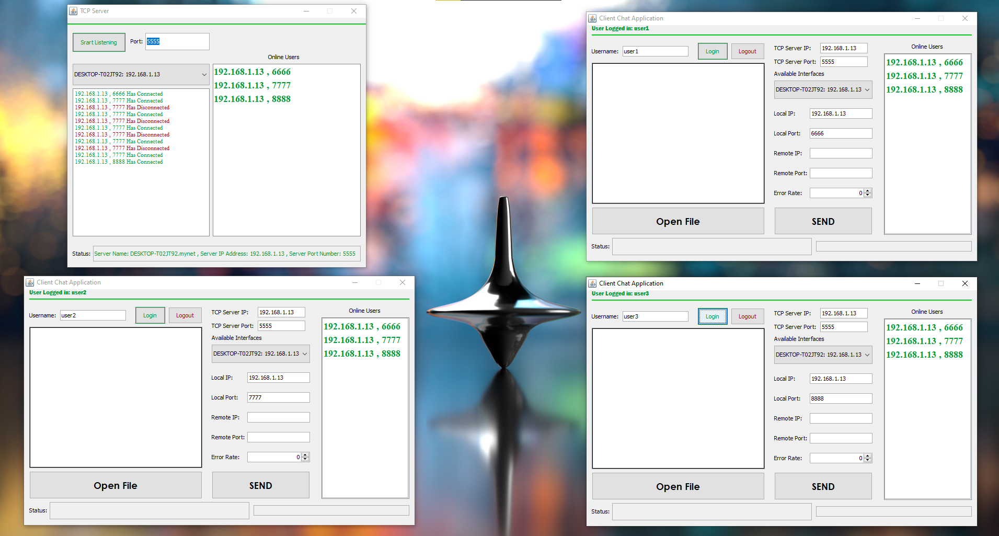
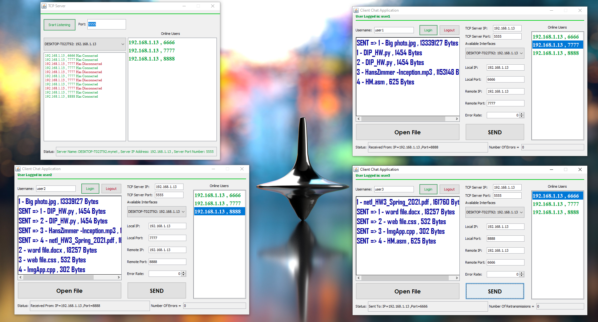
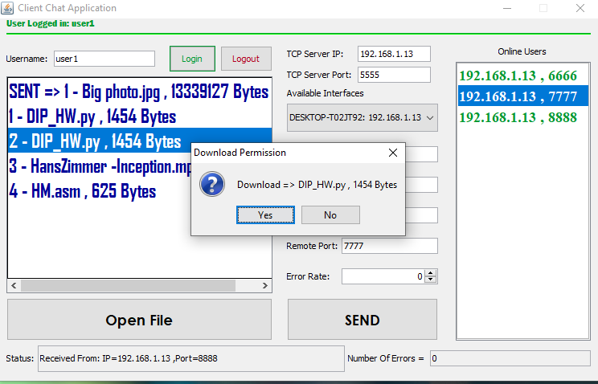
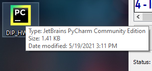
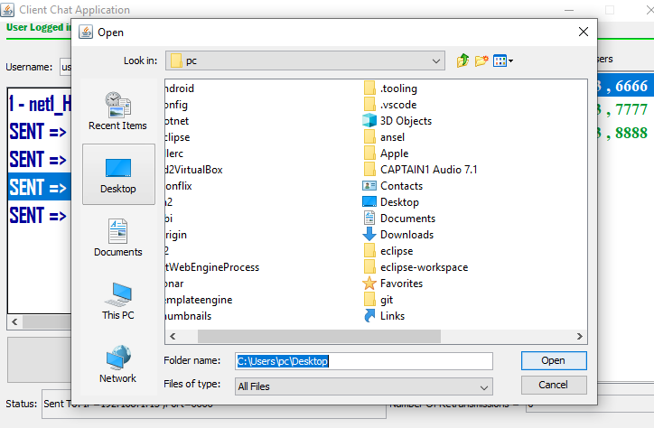
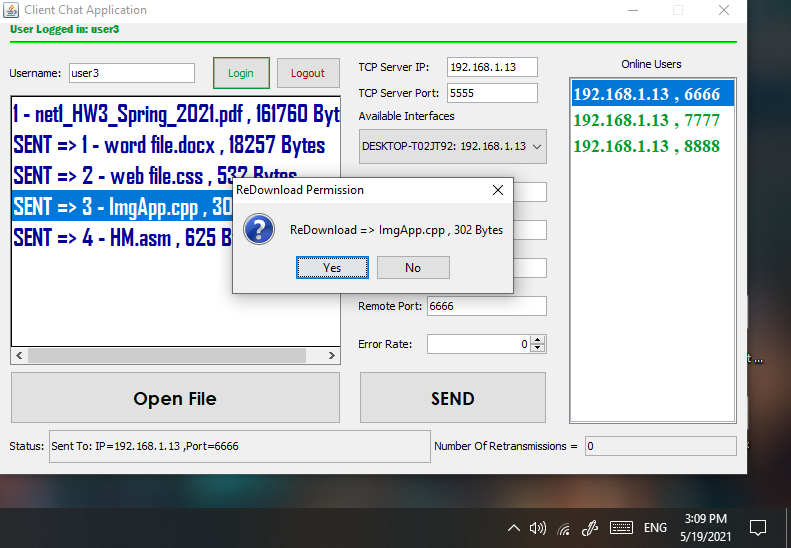
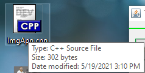
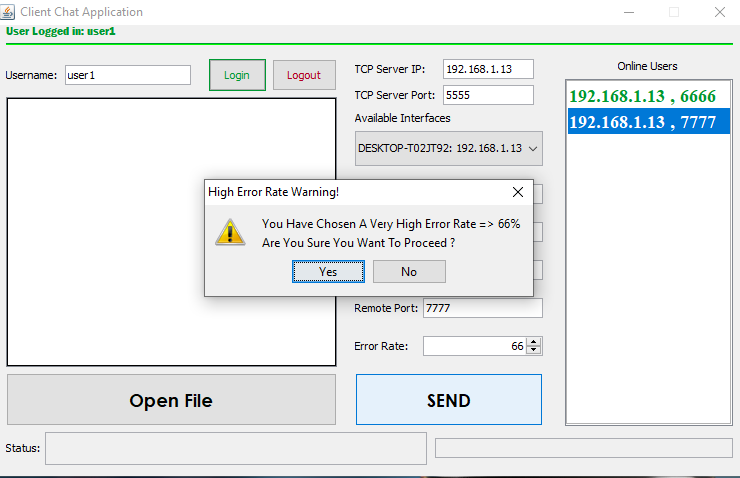

# Feillo
<pre>
Feilo
  Created a live Chat messenger with file system Using UDP protocol for transmitting and receiving
  messages/Files. Using Chunked transfer data with UDP.
  Enhanced and error handling using: RDT 3.0 protocol with acknowledgement and timeouts. Available Upon Request.
  Tracking Online Users with TCP Protocol in addition to Multithreading.
  Used Language: JAVA (IDE NetBeans 8.2) | Multithreading.
</pre>

